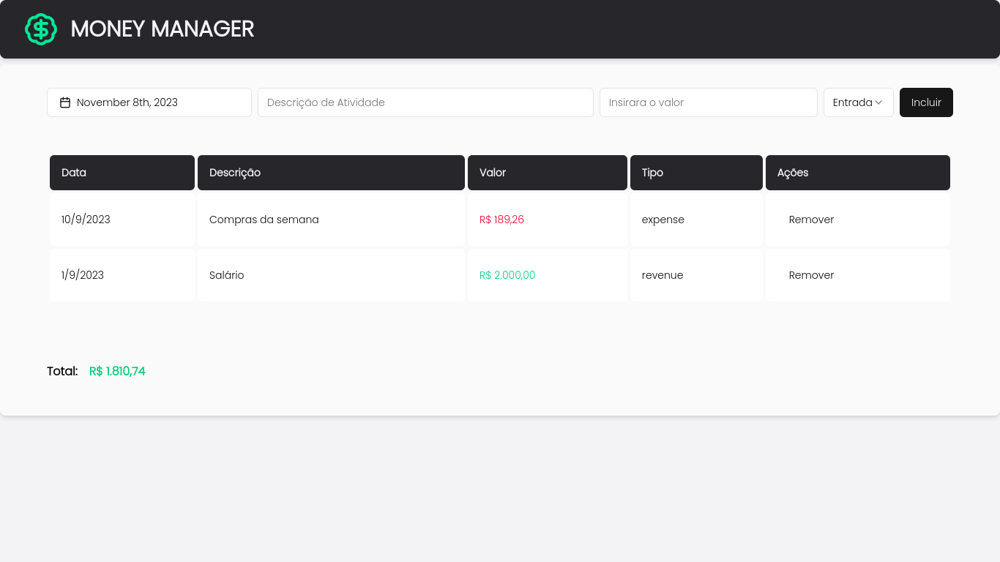

<h3 align="center">Money Manager</h3>

<div align="center">
 <p align="center">
 
 
 
</p>
</div>

---

<p align="center">Full Stack application for money management
    <br> 
</p>


## About <a name = "about"></a>
The Money Manager is a application with beautiful interface that simplifies the recording activities financial, while also providing information about the
available balance.



## Getting Started <a name = "getting_started"></a>

### Cloning repository the repository
```
git clone https://github.com/lemuel-sousa/money-manager.git
```

For more information see the [**backend**](/backend/) and [**frontend**](/frontend/) documentation.